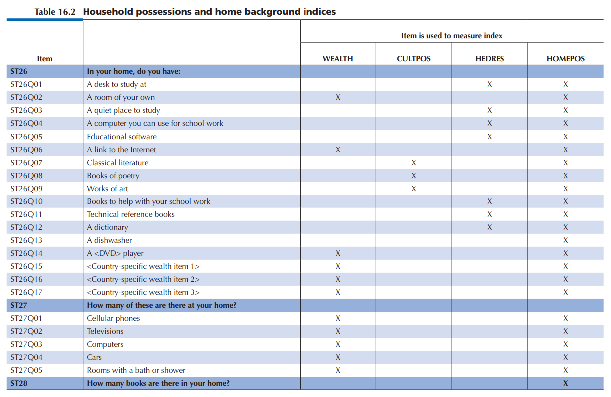

# Effects of Students Background and Habits on their PISA Scores

### by Rubén Vilela Freire
Code for project 5 Udacity's Data Analyst Nanodegree

## Overview of the dataset

This document explores the 2012 PISA report dataset, which contains data related to the preparation of students for real-life challenges. Since the file is huge (it contains 636 variables and 485490 observations), only 22 variables have been chosen.

### Which is the structure of the dataset?

Out of the 22 variables that have been chosen, 8 are categorical in nature, while the remaining 14 are numerical. Although some of these variables are easy to understand, there are others that need further explanation given in the chapter 16 of the [PISA technical report](https://www.oecd.org/pisa/pisaproducts/PISA-2012-technical-report-final.pdf):

- **Inmigration status**: (1) native parent (those parents who had at least one parent (students’ grandparent) born in the country of the assessment); (2) second generation parent (those born in the country of assessment but whose parent(s) were born in another country); (3) first-generation parent (those parent born outside the country of assessment and whose parents were also born outside the country of assessment). Parents with missing responses for either the parent or for both grandparents were assigned missing values for these.

- **Cultural distance**: Distance between host and heritage culture. A higher number indicates less cultural distance.

- **International Language at Home**: (1) language at home is the same as the language of assessment for that student and (2) language at home is another language.

- **Family Structure**: “1” if “single parent family” (students living with only one of the following: mother, father, male guardian, female guardian), “2” if “two parent family” (students living with a father or step/foster father and a mother or step/foster mother) and “3” for students who do not live with their parents.

- **Highest educational level of parents**: (0) None, (1) ISCED 3A (general upper secondary) and/or ISCED 4 (non-tertiary post-secondary), (2) ISCED 5B (vocational tertiary), (3) ISCED 5A, 6 (theoretically oriented tertiary and post-graduate).

- **Home Possessions**: This index is a summary of all household items from the columns wealth, cultural_possessions and home_educational_resources, but it also included the variable indicating the number of books at home (ST28) which was recoded from the original six categories into three: (0) 0-25 books, (1) 26-100 books, (2) more than 100.

- **Sense of belonging**: This indicates the degree to which each student feels that he or she belongs to his or her school. The PISA report states that this indicator has a moderate to low reliability. A higher number indicates a higher sense of belonging.

- **Perceived control**: To what extent do you identify with the statement "I can succeed with enough effort"? The answers would range from "strongly agree" to "strongly disagree".

- **Learning strategies**: Learn the important parts of the subject, relate new knowledge to existing concepts and learn by heart.

These variables have been taken because they belong to groups that are believed to influence the grades of each discipline such as time, study or computer time, family context (family structure, parents' education and the 4 variables associated with possessions), immigration (immigration status, cultural distance and international language) or psychological factors of the student (feeling of belonging, learning strategies and perceived control).

### Which are the main features of interest?

The variables that will serve as a reference point in this dataset will be the scores in mathematics, reading and science

### What features will help support the investigation into the features of interest?

From an initial point of view, it is expected that the greatest influence on student grades will be associated with increased study time. To a lesser extent, the family context, psychological variables and finally, immigration differences.

### Conclusions

- Social class, measured as the number of belongings at home, affects the student's overall score, with a difference of almost 100 points between the high and low social class. The average difference between the high and middle class is 40 points.

- More study time improves the student's score as long as this time does not exceed 20 hours per week. The most efficient weekly amount of study is between 5 and 20 hours, with only a 20-point variation.

- A higher level of education has a positive impact on the student's overall grade in the middle and upper social classes. However, in the lower social class, the maximum grade peak is reached with a parental education of ISCED 3B, 4. 

- Although the impact of parents' educational background is positively related to students' grades, it is more influential in families with native-born parents. In the case of parents with an educational level up to ISCED 2, students with second-generation immigrant parents show better test scores.

- Contrary to what was thought at the beginning of this project, the variables that most affect the student's overall score are those of the family context, more specifically the educational level of the parents and the number of possessions at home. Although study time also affects the result, it does so in a more modest way.
